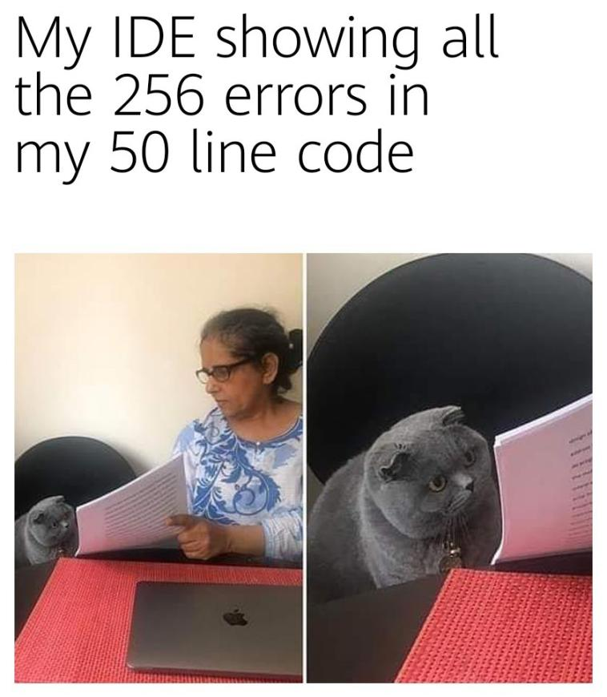

# Yijie Ruan

## CSE110 WI21

**Introduction**

* My name is Yijie. You can call my Steven
* I am a second-year computer science major at UCSD
* This is the page for my project in CSE110
>So this would be fun. I guess

### What I like

1. Game
   - League of Legends
   
   
  
2. Anime
   - To Watch 2021
     - [x] Tonikaku Kawaii
     - [ ] Kaguya-sama: Love is War Season 3
     - [ ] Cells at Work! 
3. Write codes

   

### What I am Practicing

Some basic *Git commands* are:
```
git status
git add
git commit
```

This site was built using [GitHub Pages](https://pages.github.com/).

[Contribution guidelines for this project](README.md)
